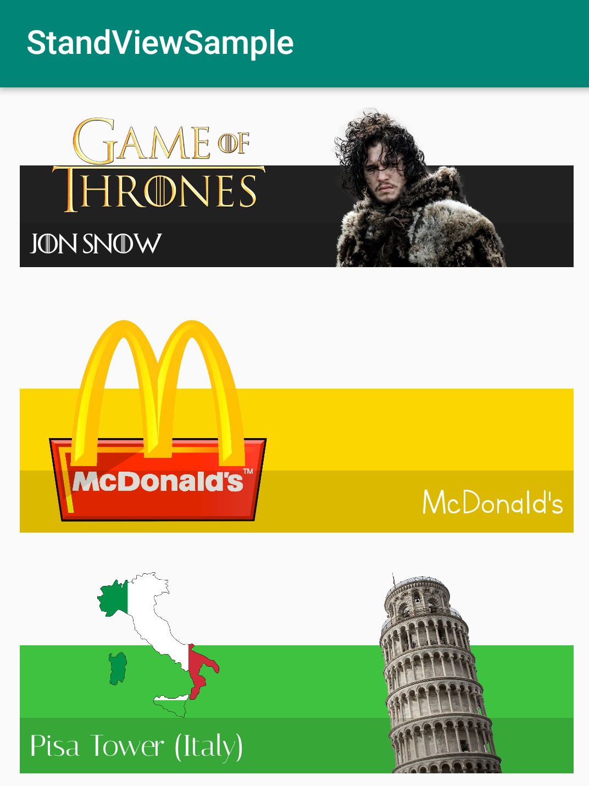

## StandView

### Introduction

Library made for personal use and uploaded to GitHub for convenience. This version may not be finished, now or never.

Layout made to show a title and one or two images attached, showing a character, a brand, a famous place, or anything else you want.

Example below:

#### Screenshot

 

### ++TO-DO List++ (In development)

* ~~Basic functionality~~
* ~~Dinamic constraints on title side change~~
* ~~Properties available through code~~
* Change font unit
* Custom drawable for background

### Usage

##### Import

For now, download and compile the module with your project.
```gradle
implementation project(':standview')
```

##### Properties

| XML | Code |
|---|---|
| backgroundColor (color) | setBackgroundColor(int) |
| leftImage (drawable) | setLeftImage(Drawable) |
| rightImage (drawable) | setRightImage(Drawable) |
| titleText (string) | setTitleText(String) / String getTitleText() |
| titleColor (color) | setTitleColor(int) / int getTitleColor() |
| titleSize (dp / sp) | setTitleSize(float) / float getTitleSize() |
| titlePadding (dp / sp) | setTitlePadding(float) |
| titleBackground (color) | setTitleBackground(int) |
| titleRightSide (boolean) | setRightSide(boolean) / boolean getRightSide() |
| | setTypeface(Typeface) / Typeface getTypeface() |

##### Example


```java
StandView stand = findViewById(R.id.stand);
stand.setTypeface(ResourcesCompat.getFont(MainActivity.this, R.font.italiana));
```

```xml
<ncatz.jvmed.standview.StandView
    android:id="@+id/stand"
    android:layout_width="match_parent"
    android:layout_height="wrap_content"
    android:layout_margin="12dp"
    app:backgroundColor="#3fc23f"
    app:leftImage="@drawable/c"
    app:rightImage="@drawable/c2"
    app:titleBackground="#22000000"
    app:titleColor="@android:color/white"
    app:titlePadding="6dp"
    app:titleRightSide="false"
    app:titleSize="6dp"
    app:titleText="Pisa Tower (Italy)" />
```

### Contact

* Email : <javimedinilla@gmail.com>

### License

	MIT License

   	Copyright (c) 2018 Javier Medinilla

    Permission is hereby granted, free of charge, to any person obtaining a copy
    of this software and associated documentation files (the "Software"), to deal
    in the Software without restriction, including without limitation the rights
    to use, copy, modify, merge, publish, distribute, sublicense, and/or sell
    copies of the Software, and to permit persons to whom the Software is
    furnished to do so, subject to the following conditions:

    The above copyright notice and this permission notice shall be included in all
    copies or substantial portions of the Software.

    THE SOFTWARE IS PROVIDED "AS IS", WITHOUT WARRANTY OF ANY KIND, EXPRESS OR
    IMPLIED, INCLUDING BUT NOT LIMITED TO THE WARRANTIES OF MERCHANTABILITY,
    FITNESS FOR A PARTICULAR PURPOSE AND NONINFRINGEMENT. IN NO EVENT SHALL THE
    AUTHORS OR COPYRIGHT HOLDERS BE LIABLE FOR ANY CLAIM, DAMAGES OR OTHER
    LIABILITY, WHETHER IN AN ACTION OF CONTRACT, TORT OR OTHERWISE, ARISING FROM,
    OUT OF OR IN CONNECTION WITH THE SOFTWARE OR THE USE OR OTHER DEALINGS IN THE
    SOFTWARE.